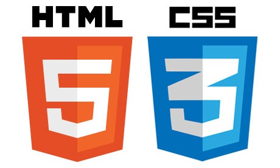
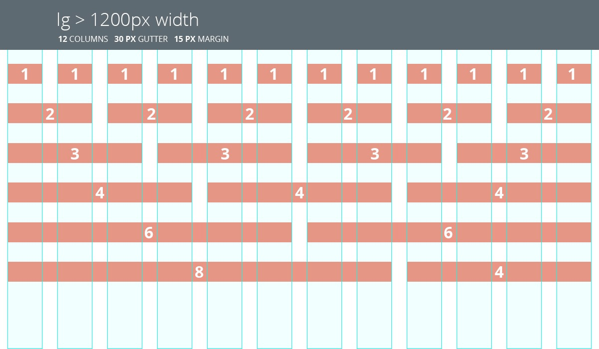

#HSLIDE

### HTML/CSS



Сергей Денисов  
Старший фронтенд-разработчик

04.12.2017

#HSLIDE

### Библиотеки компонентов

* Основная цель: стандартизация компонентов на сайте и ускорение/упрощение разработки.
* Обычно состоят из: модульной сетки, компонентов, вспомогательных утилит и т.д.
* Обычно используют CSS-препроцессоры. 

Примеры:
* [Twitter Bootstrap](https://getbootstrap.com) ([использование](https://jsfiddle.net/sergdenisov/hngh2bec/)).
* [Bloko](http://hhru.github.io/bloko/).

#HSLIDE

### CSS: [модульные сетки](http://htmlbook.ru/content/modulnaya-setka)

[Модульная сетка](htmlbook.ru/content/modulnaya-setka) представляет собой набор невидимых направляющих, вдоль которых
располагаются элементы страницы. Профит:

* Это облегчает размещение данных в документе.
* Обеспечивает визуальную связь между отдельными блоками.
* Сохраняет преемственность дизайна при переходе от одной страницы к другой.

#VSLIDE

Обычно состоит из:

* Контейнера.
* Строки.
* Ячейки.
* Отступов.

#VSLIDE



Примеры: [Twitter Bootstrap](https://getbootstrap.com/docs/4.0/layout/grid/), [960 Grid System](http://960.gs).

#VSLIDE

### CSS: [модульная сетка в Twitter Bootstrap](https://getbootstrap.com/docs/4.0/layout/grid/)

```html
<div class="container">
    <div class="row">
        <div class="col">
            One of three columns
        </div>
        <div class="col">
            One of three columns
        </div>
        <div class="col">
            One of three columns
        </div>
    </div>
</div>
```

#VSLIDE

### CSS: [Mobile First](https://www.sitepoint.com/introduction-mobile-first-media-queries/)


Примеры: [Desktop First](https://jsfiddle.net/sergdenisov/9mgrw25e/) vs [Mobile First](https://jsfiddle.net/sergdenisov/8r8z3akx/).
