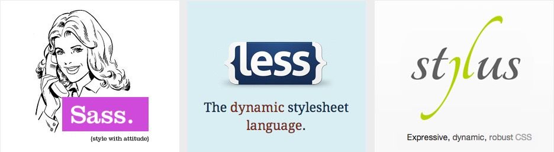
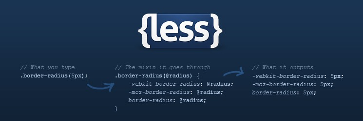

#HSLIDE

### HTML/CSS


Сергей Денисов  
Старший фронтенд-разработчик

04.12.2017

#HSLIDE

### Библиотеки компонентов

* Основная цель: стандартизация компонентов на сайте и ускорение/упрощение разработки.
* Обычно состоят из: модульной сетки, компонентов, вспомогательных утилит и т.д.
* Обычно используют CSS-препроцессоры. 

Примеры:
* <a href="https://getbootstrap.com" target="_blank">Twitter Bootstrap</a> (<a href="https://jsfiddle.net/sergdenisov/hngh2bec/" target="_blank">использование</a>).
* <a href="http://hhru.github.io/bloko/" target="_blank">Bloko</a>.

#HSLIDE

### CSS: <a href="http://htmlbook.ru/content/modulnaya-setka" target="_blank">модульные сетки</a>.

<a href="http://htmlbook.ru/content/modulnaya-setka" target="_blank">Модульная сетка</a> представляет собой набор невидимых направляющих, вдоль которых
располагаются элементы страницы. Профит:

* Это облегчает размещение данных в документе.
* Обеспечивает визуальную связь между отдельными блоками.
* Сохраняет преемственность дизайна при переходе от одной страницы к другой.

#VSLIDE

Обычно состоит из:

* Контейнера.
* Строки.
* Ячейки.
* Отступов.

#VSLIDE


Примеры: <a href="https://getbootstrap.com/docs/4.0/layout/grid/" target="_blank">Twitter Bootstrap</a>, <a href="http://960.gs" target="_blank">960 Grid System</a>.

#VSLIDE

### CSS: <a href="https://getbootstrap.com/docs/4.0/layout/grid/" target="_blank">модульная сетка в Twitter Bootstrap</a>

```html
<div class="container">
    <div class="row">
        <div class="col">
            One of three columns
        </div>
        <div class="col">
            One of three columns
        </div>
        <div class="col">
            One of three columns
        </div>
    </div>
</div>
```

#VSLIDE

### CSS: <a href="https://www.sitepoint.com/introduction-mobile-first-media-queries/" target="_blank">Mobile First</a>


Примеры: <a href="https://jsfiddle.net/sergdenisov/9mgrw25e/" target="_blank">Desktop First</a> vs <a href="https://jsfiddle.net/sergdenisov/8r8z3akx/" target="_blank">Mobile First</a>.

#HSLIDE

### CSS: <a href="https://developer.mozilla.org/en-US/docs/Web/CSS/CSS_Flexible_Box_Layout/Using_CSS_flexible_boxes" target="_blank">flexbox</a>


<a href="https://jsfiddle.net/sergdenisov/zwrroac2/" target="_blank">Пример 1</a>, <a href="https://jsfiddle.net/sergdenisov/95y31w8j/" target="_blank">пример 2</a>, <a href="http://frontender.info/a-guide-to-flexbox/" target="_blank">статья</a>.

#VSLIDE

Свойства flex-контейнера (родительского элемента):

```css
display: flex | inline-flex
flex-direction: row | row-reverse | column | column-reverse
flex-wrap: nowrap | wrap | wrap-reverse
flex-flow: <'flex-direction'> || <'flex-wrap'>
```

#VSLIDE

```css
justify-content: flex-start | flex-end | center |
                 space-between | space-around
```


#VSLIDE

```css
align-items: flex-start | flex-end | center |
             baseline | stretch
```


#VSLIDE

```css
align-content: flex-start | flex-end | center |
               space-between | space-around | stretch
```


#VSLIDE

Свойства дочерних элементов:

```css
order: <integer>
flex-grow: <number> (default 0)
flex-shrink: <number> (default 1)
flex-basis: <length> | auto (default auto)
flex: [<'flex-grow'> <'flex-shrink'>? || <'flex-basis'>]
      (default 0 1 auto)
align-self: auto | flex-start | flex-end | center |
            baseline | stretch
```

#HSLIDE

### CSS: <a href="https://www.urbaninsight.com/2012/04/12/ten-reasons-you-should-be-using-css-preprocessor" target="_blank">препроцессоры</a>

<a href="https://habrahabr.ru/sandbox/78148/" target="_blank">Препроцессоры</a> компилируют СSS код, который мы пишем на процессорном языке в чистый, валидный CSS код. Профит:

* Расширяют синтаксис CSS недостающими возможностями.
* Уменьшают дублирование кода.
* Делают код более структурированным.
* Упрощают поддержку кода.

#VSLIDE

### CSS: <a href="https://www.sitepoint.com/6-current-options-css-preprocessors/" target="_blank">популярные препроцессоры</a>



* <a href="http://sass-lang.com/guide" target="_blank">SASS/SCSS</a>.
* <a href="http://stylus-lang.com" target="_blank">Stylus</a>.
* <a href="http://lesscss.org/features/#features-overview-feature" target="_blank">LESS</a>.

#HSLIDE

### <a href="http://lesscss.org" target="_blank">LESS</a>



#VSLIDE

### LESS: <a href="http://lesscss.org/#using-less" target="_blank">использование</a>

* <a href="http://lesscss.org/#client-side-usage" target="_blank">Подключение скрипта</a>:

```html
<script src="less.js"></script>
```

* <a href="http://lesscss.org/#using-less-command-line-usage" target="_blank">Через командную строку</a>:

```bash
npm install -g less

lessc styles.less
```

* <a href="https://www.npmjs.com/package/gulp-less" target="_blank">Через плагин для сборщика</a>.

#VSLIDE

### LESS: <a href="http://lesscss.org/features/#features-overview-feature-variables" target="_blank">переменные</a>

```less
@nice-blue: #5b83ad;
#header {
    color: @nice-blue;
}
```

```css
#header {
    color: #5b83ad;
}
```

#VSLIDE

### LESS: <a href="http://lesscss.org/features/#features-overview-feature-mixins" target="_blank">миксины</a>

```less
.my-mixin {
    color: black;
}
.my-other-mixin() {
    background: white;
}
.block {
    .my-mixin;
    .my-other-mixin;
}
```

```css
.my-mixin {
    color: black;
}
.block {
    color: black;
    background: white;
}

```

#VSLIDE

### LESS: <a href="http://lesscss.org/features/#mixins-parametric-feature" target="_blank">параметризированные миксины</a>

```less
.border-radius(@radius: 5px) {
    -webkit-border-radius: @radius;
    border-radius: @radius;
}
.button {
    .border-radius(6px);
}
```

```css
.button {
    -webkit-border-radius: 6px;
    border-radius: 6px;
}
```

#VSLIDE

### LESS: <a href="http://lesscss.org/features/#features-overview-feature-nested-rules" target="_blank">вложенные правила</a>

```less
#header {
    color: black;
    .navigation {
        font-size: 12px;
    }
    .logo {
        width: 300px;
    }
}
```

```css
#header {
    color: black;
}
#header .navigation {
    font-size: 12px;
}
#header .logo {
    width: 300px;
}

```

#VSLIDE

### LESS: <a href="http://lesscss.org/features/#features-overview-feature-nested-directives-and-bubbling" target="_blank">вложенные директивы и всплытие</a>

```less
.screen-color {
    @media screen {
        color: green;
        @media (min-width: 768px) {
            color: red;
        }
    }
    @media tv {
        color: black;
    }
}
```

#VSLIDE

### LESS: <a href="http://lesscss.org/features/#parent-selectors-feature" target="_blank">родительские селекторы</a>

```less
a {
    color: blue;
    &:hover {
        color: green;
    }
}
```

```css
a {
    color: blue;
}
a:hover {
    color: green;
}
```

#VSLIDE

### LESS: <a href="http://lesscss.org/features/#features-overview-feature-operations" target="_blank">математические операции</a>

```less
// numbers are converted into the same units
@conversion-1: 5cm + 10mm; // result is 6cm
@conversion-2: 2 - 3cm - 5mm; // result is -1.5cm
// conversion is impossible
@incompatible-units: 2 + 5px - 3cm; // result is 4px
// example with variables
@base: 5%;
@filler: @base * 2; // result is 10%
@other: @base + @filler; // result is 15%
```

```less
@base: 2cm * 3mm; // result is 6cm
```

```less
@color: #224488 / 2; // results in #112244
background-color: #112244 + #111; // result is #223355
```

#VSLIDE

### LESS: <a href="http://lesscss.org/features/#features-overview-feature-functions" target="_blank">функции</a>

```less
@base: #f04615;
@width: 0.5;
.class {
    width: percentage(@width); // returns 50%
    color: darken(@base, 5%); // returns #dd3d0e
    background-color: lighten(@base, 10%); // returns #f36c45
}
```

#VSLIDE

### LESS: <a href="http://lesscss.org/features/#loops-feature" target="_blank">циклы</a>

```less
.loop(@counter) when (@counter > 0) {
    .loop((@counter - 1)); // next iteration
    width: (10px * @counter); // code for each iteration
}
div {
    .loop(5); // launch the loop
}
```

```css
div {
    width: 10px;
    width: 20px;
    width: 30px;
    width: 40px;
    width: 50px;
}
```

#VSLIDE

### LESS: <a href="http://lesscss.org/features/#import-directives-feature" target="_blank">импорты</a>

```less
@import "foo"; // foo.less is imported
@import "foo.less"; // foo.less is imported
@import "foo.php";  // foo.php imported as a less file
@import "foo.css";  // statement left in place, as-is
@import (optional, reference) "foo.less";
@import (less) "foo.css";
```

#VSLIDE

### LESS: <a href="http://lesscss.org/features/#features-overview-feature-comments" target="_blank">комментарии</a>

```less
/* One hell of a block
style comment! */
@var: red;
// Get in line!
@var: white;
```
