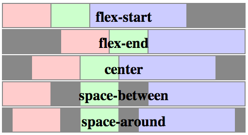

#HSLIDE

### HTML/CSS


Сергей Денисов  
Старший фронтенд-разработчик

04.12.2017

#HSLIDE

### Библиотеки компонентов

* Основная цель: стандартизация компонентов на сайте и ускорение/упрощение разработки.
* Обычно состоят из: модульной сетки, компонентов, вспомогательных утилит и т.д.
* Обычно используют CSS-препроцессоры. 

Примеры:
* <a href="https://getbootstrap.com" target="_blank">Twitter Bootstrap</a> (<a href="https://jsfiddle.net/sergdenisov/hngh2bec/" target="_blank">использование</a>).
* <a href="http://hhru.github.io/bloko/" target="_blank">Bloko</a>.

#HSLIDE

### CSS: <a href="http://htmlbook.ru/content/modulnaya-setka" target="_blank">модульные сетки</a>.

<a href="http://htmlbook.ru/content/modulnaya-setka" target="_blank">Модульная сетка</a> представляет собой набор невидимых направляющих, вдоль которых
располагаются элементы страницы. Профит:

* Это облегчает размещение данных в документе.
* Обеспечивает визуальную связь между отдельными блоками.
* Сохраняет преемственность дизайна при переходе от одной страницы к другой.

#VSLIDE

Обычно состоит из:

* Контейнера.
* Строки.
* Ячейки.
* Отступов.

#VSLIDE


Примеры: <a href="https://getbootstrap.com/docs/4.0/layout/grid/" target="_blank">Twitter Bootstrap</a>, <a href="http://960.gs" target="_blank">960 Grid System</a>.

#VSLIDE

### CSS: <a href="https://getbootstrap.com/docs/4.0/layout/grid/" target="_blank">модульная сетка в Twitter Bootstrap</a>

```html
<div class="container">
    <div class="row">
        <div class="col">
            One of three columns
        </div>
        <div class="col">
            One of three columns
        </div>
        <div class="col">
            One of three columns
        </div>
    </div>
</div>
```

#VSLIDE

### CSS: <a href="https://www.sitepoint.com/introduction-mobile-first-media-queries/" target="_blank">Mobile First</a>


Примеры: <a href="https://jsfiddle.net/sergdenisov/9mgrw25e/" target="_blank">Desktop First</a> vs <a href="https://jsfiddle.net/sergdenisov/8r8z3akx/" target="_blank">Mobile First</a>.

#HSLIDE

### CSS: <a href="https://developer.mozilla.org/en-US/docs/Web/CSS/CSS_Flexible_Box_Layout/Using_CSS_flexible_boxes" target="_blank">flexbox</a>


<a href="https://jsfiddle.net/sergdenisov/zwrroac2/" target="_blank">Пример 1</a>, <a href="https://jsfiddle.net/sergdenisov/95y31w8j/" target="_blank">пример 2</a>, <a href="http://frontender.info/a-guide-to-flexbox/" target="_blank">статья</a>.

#VSLIDE

Свойства flex-контейнера (родительского элемента):

```css
display: flex | inline-flex
flex-direction: row | row-reverse | column | column-reverse
flex-wrap: nowrap | wrap | wrap-reverse
flex-flow: <'flex-direction'> || <'flex-wrap'>
```

#VSLIDE

```css
justify-content: flex-start | flex-end | center |
                 space-between | space-around
```



#VSLIDE

```css
align-items: flex-start | flex-end | center |
             baseline | stretch
```


#VSLIDE

```css
align-content: flex-start | flex-end | center |
               space-between | space-around | stretch
```


#VSLIDE

Свойства дочерних элементов:

```css
order: <integer>
flex-grow: <number> (default 0)
flex-shrink: <number> (default 1)
flex-basis: <length> | auto (default auto)
flex: [<'flex-grow'> <'flex-shrink'>? || <'flex-basis'>]
      (default 0 1 auto)
align-self: auto | flex-start | flex-end | center |
            baseline | stretch
```

#HSLIDE

### CSS: <a href="https://www.urbaninsight.com/2012/04/12/ten-reasons-you-should-be-using-css-preprocessor" target="_blank">препроцессоры</a>

<a href="https://habrahabr.ru/sandbox/78148/" target="_blank">Препроцессоры</a> компилируют СSS код, который мы пишем на процессорном языке в чистый, валидный CSS код. Профит:

* Расширяют синтаксис CSS недостающими возможностями.
* Уменьшают дублирование кода.
* Делают код более структурированным.
* Упрощают поддержку кода.

#VSLIDE

### CSS: <a href="https://www.sitepoint.com/6-current-options-css-preprocessors/" target="_blank">популярные препроцессоры</a>


* <a href="http://sass-lang.com/guide" target="_blank">SASS/SCSS</a>.
* <a href="http://stylus-lang.com" target="_blank">Stylus</a>.
* <a href="http://lesscss.org/features/#features-overview-feature" target="_blank">LESS</a>.
